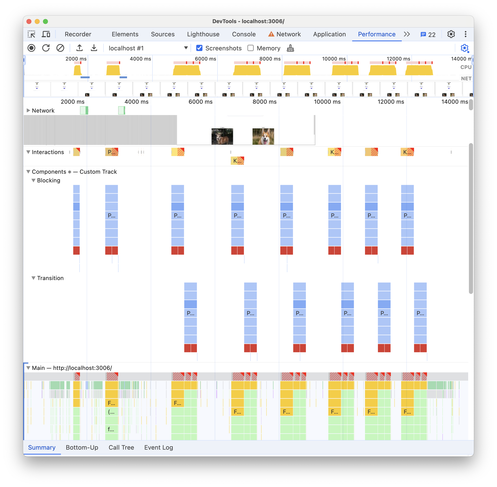
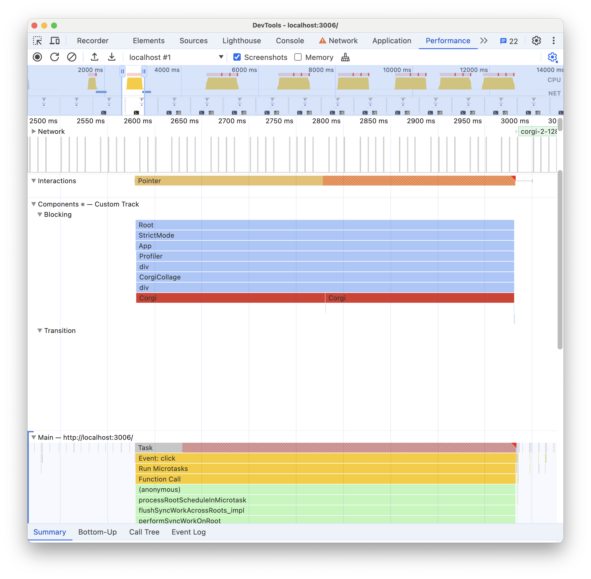
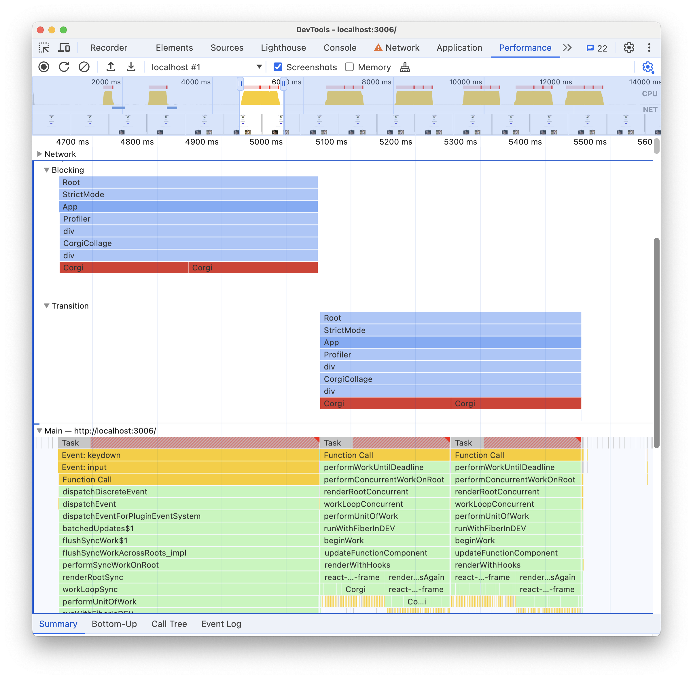
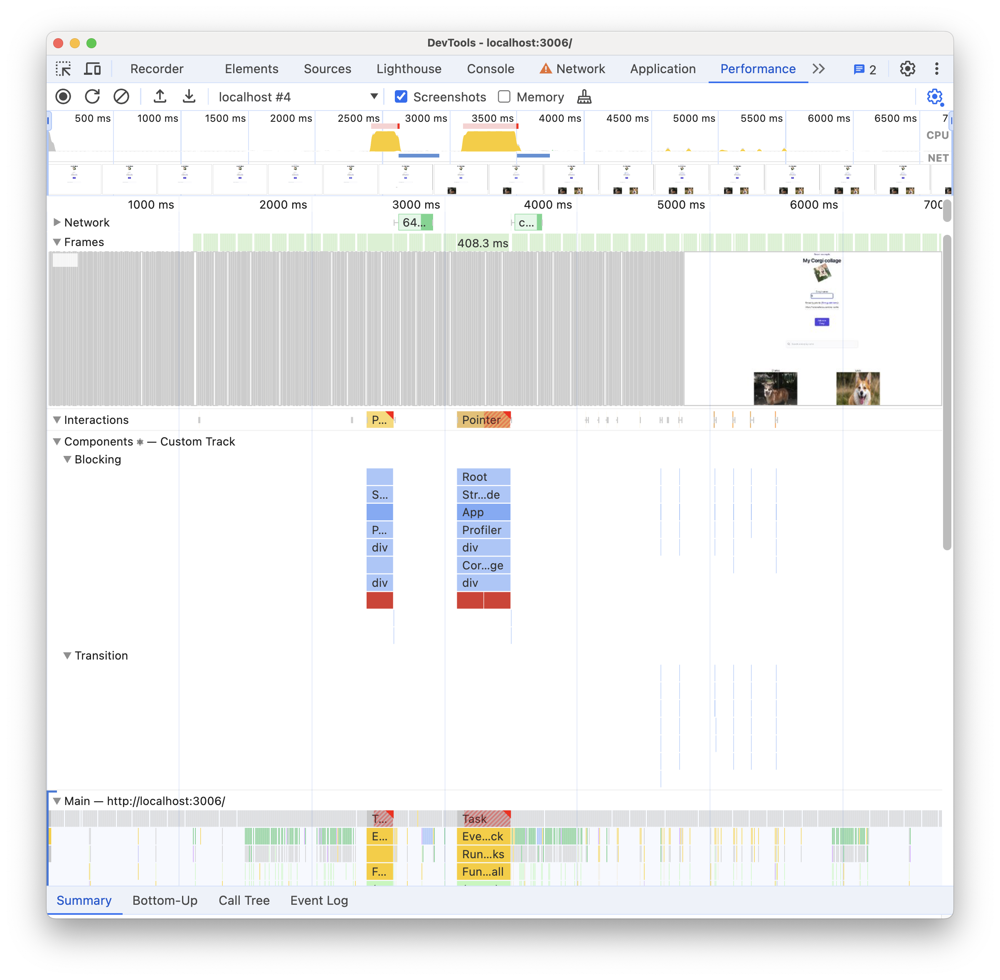
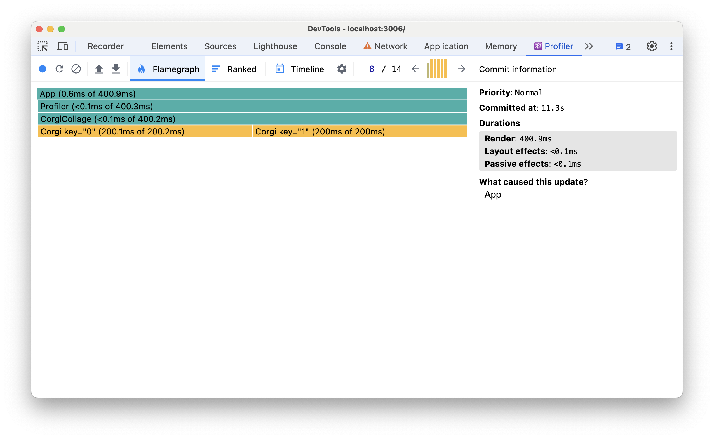
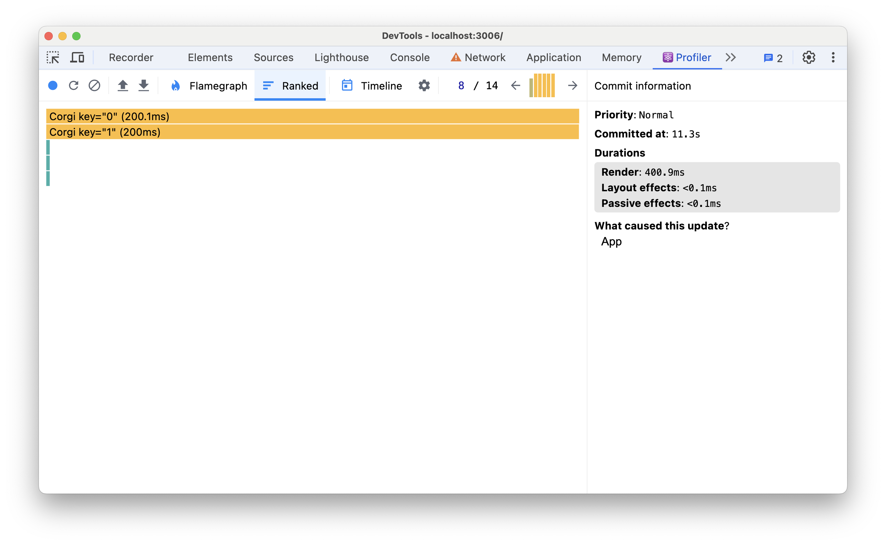
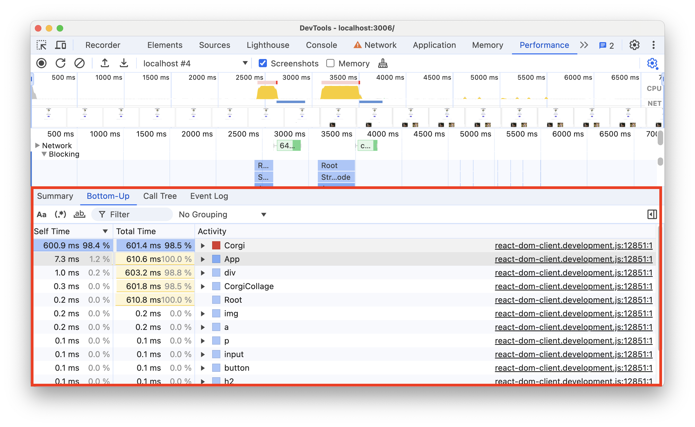

# React Corgi Collage

This is a basic React app that exemplifies how the Chrome DevTools
Performance panel can be used to profile React applications. This is
with the Chrome DevTools Performance panel looks like 

## Run the code

1. Clone this repo if you haven't
```bash
git clone https://github.com/and-oli/corgi-collage-React.git
```
2. Install deps and start server
```bash
npm i && npm run start
```

## Note about the set up

This example enables the React instrumentation that uses the 
[Performance panel extensibility API](https://developer.chrome.com/docs/devtools/performance/extension) by satisfying two preconditions:

1. Using the experimental channels of React and React DOM. Note how in
the [package.json](./package.json#L10) file, the declared version of these
deps correspond to experimental versions (`0.0.0-experimental-*`).

2. The main App is wrapped by the `Profiler` component.

At the moment this example is created, the instrumentation is gated under
these two conditions. Ideally, the first precondition is lifted as the
integration becomes more stable with time, and the regular stable
channel can be used instead of the experimental one.

## Overview of the code

The app consists of two files:
1. App.js: implements the main component of
the app (`<App/>`) 
2. CorgiCollage: implements two components: `<CorgiCollage/>` and 
`<Corgi/>`.

App<br>
-----CorgiCollage<br>
----------Corgi<br>


When the user interacts with the app by changing the new corgi form,
by pressing the "Add new Corgi button" or typing in the search bar the
state of the App component is updated, which consists of `corgis`, `newCorgiName`, `newCorgiSecurityPhoto` and `corgiSearch` state vars.

From these state vars, only `corgis` and `corgiSearch` are propagated to
the `CorgiCollage` child component via its props.

Particularly important for this example is the fact that the
`CorgiCollage` component is not memoized by default in the `App` 
component, meaning that whenever the state of the `App` component
changes, the `CorgiCollage` component will re-render, regardless if its
props (`corgis` and `corgiSearch`) remain unchanged. This is done
purposefully for the sake of exemplifying how a perf bottle neck can be
debugged. The rendering of the `Corgi` component is also made slow on
purpose for this example.

Finally, it's also important to note that we are making use of the
[`useTransition`](https://react.dev/reference/react/useTransition) React
hook, which allows you to update a state variable without blocking the
UI. We are using it to update the `newCorgiName` state variable
(whenever the new corgi name input is changed).

## Profiling the app

### Bottleneck overview
Follow the following steps to reproduce a Performance bottleneck,
for which we'll use the Perf panel to debug.

#### Repro steps

1. Run the code and open the app in Chrome (>=128)
2. Open the Perf panel in DevTools and start recording
3. Click the Add new Corgi button. Wait until the new Corgi image
appears in the collage below.
4. Repeat 3.
5. Type something in the `Corgi name:` input bar on top, f.e. "Fluffy".
Notice how the app becomes unresponsive to interactions.
6. Stop recording.

You should see something like this in the trace view


Note there is a new track added by React, composed of two subtracks: Blocking and Transition.

Zooming in you will see the following icicle pattern:


Each entry corresponds to a component being rendered by React whenever
the state changed as we interacted with the app. The vertical ordering
denotes the hierarchy of the components in the app. Note how at the
bottom the "Corgi" component is placed with a red color. This denotes
that the self time of the rendering of the bottom-most component
(`<Corgi>`) was too long. This is expected, since we made the rendering
of this component purposefully slow.

Note how for each user interaction (Pointer and Keyboard events in the
Interactions track), one full app re-render happened. This is the
bottle neck we want to fix.
 
### Blocking and Transition tracks

The "Blocking" track shows the component renders that blocked the UI.
The "Transition" shows the component renders that didn't block the UI.
The activity in the transition track corresponds to the one executed
by the function we wrapped with the `startTransition` hook, that is
the state updates when the new corgi name input bar changes.

When you zoom in, you can see how for the activity in the "Blocking"
track there is a corresponding single Task in the Main track. Whereas
for the activity in the "Transition" track, there are multiple Tasks,
which shows that framework is yielding to the main thread when the 
`startTransition` hook is used to prevent blocking the UI.



Note: When the state changes inside a `startTransition` hook, React
schedules 2 consecutive re-renders, one blocking and one non-blocking,
which explains the two icicles that happen everytime the `newCorgiName`
state var changes.

### Fixing the bottle neck

To prevent a full app rerender on every interaction, we can make use of
memoized components, using the [memo API](https://react.dev/reference/react/memo).

In particular, we will memoize the `CorgiCollage` component when using
it in `App`. This will ensure that the `CorgiCollage` component won't
re-render when the state of its parent (`App`) changes if its props are
unaffected. This will prevent the full app re-rendering when we type in
the new corgi input bar.

To do this, simply uncomment the line 5 in [App.js](./src/App.js#L5)

If we repeat the [repro steps](#repro-steps), will see the app has
become more responsive when we type in the new corgi name input bar.

In the trace view, the improvement can be seen in how thin the icicles under the keyboard interaction became.



## Comparing with React DevTools profiler

You can see how the data added by React to the Performance panel has a
1 - 1 correspondence to data shown in the React DevTools profiler. To
see this, simply start recording with React DevTools before you start
recording with the Performance panel and follow the [repro steps](#repro-steps).
After you stop recording with the Performance panel, stop recording in
React DevTools.

## Flamegraph

In the Flamegraph view in React DevTools, you see a view analogous with
the flame chart of the React track in the Performance panel.
For each re-render (aka commit), there is a breakdown of the components rendered in it and the time each took (self and total). The vertical ordering here also represents the hierarchy of the components. You can navigate across commits using the left and right arrows on top. Each of these commits views is analogous to each icicle shown in the Performance panel flame chart.

The key differences are:
1. In React DevTools a flamegraph is used instead of a flame chart: This means that unlike in the Performance panel, there is no inherent timestamp for each component rendering: you know the order in which things happened relative to each other but not exactly when they happened relative to the recording start time.

2. For each component render block, more framework details are shown: F.e. "Priority", "Commited at", "What caused this update", etc. Currently the Performance panel extensibility API allows you to add these details to each entry, but this is still pending.



## Ranked view

The Ranked view is most analogous to the Bottom-up view in the Performance panel, where you can see activity ordered by total self time:



Compare it with the corresponding bottom-up view in the perf panel:



The key differences here being that the bottom up view of the Perf panel is aggregated accross the currently selected time window, whereas the ranked view is separated per re-render. The Perf panel also includes rendering data pertaining to html elements (div, img, etc.), whereas React DevTools is purely in terms of React components. Of course, the bottom up view also allows you to walk up the call tree, something the Ranked view isn't meant to do.

## Timeline

At the moment, the instrumentation that feeds the Timeline view in React DevTools, is not using the
Performance panel extensibility API, so there is no analogous view for that in the Performance
panel yet.
